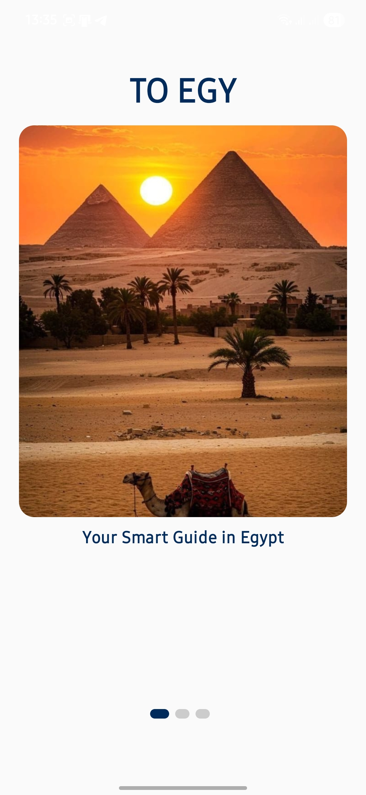
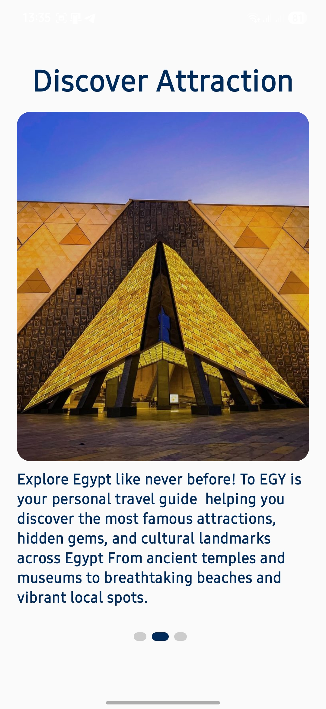
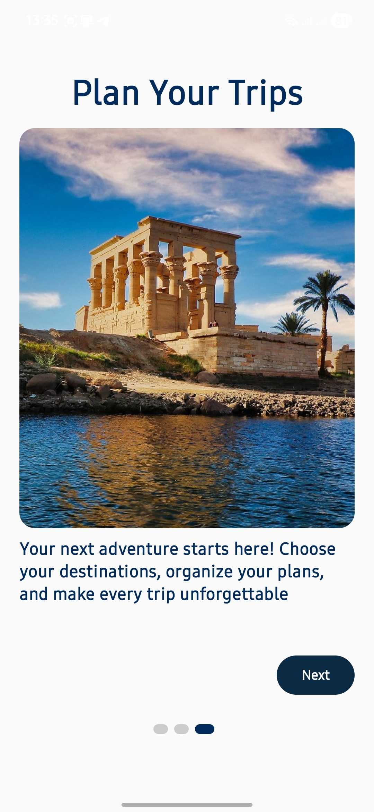
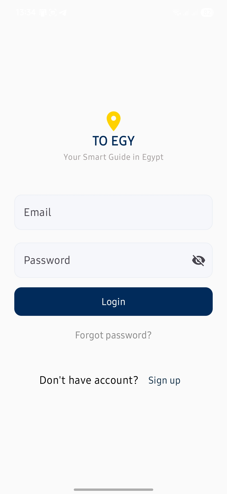
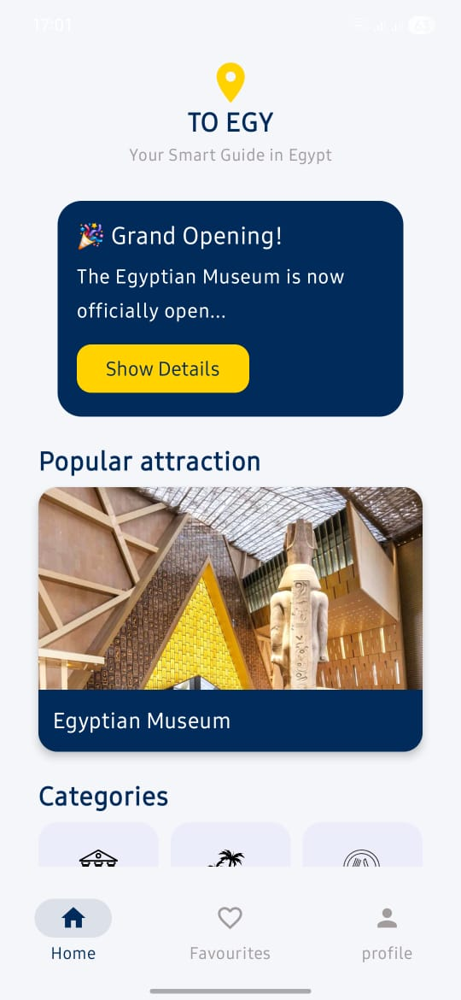
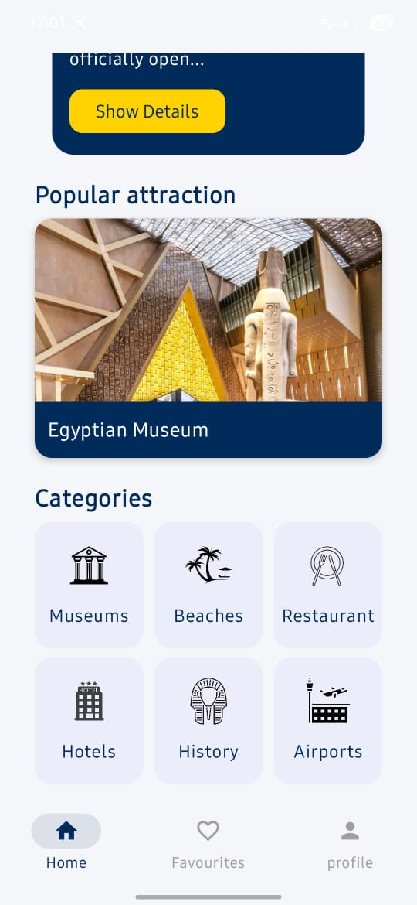
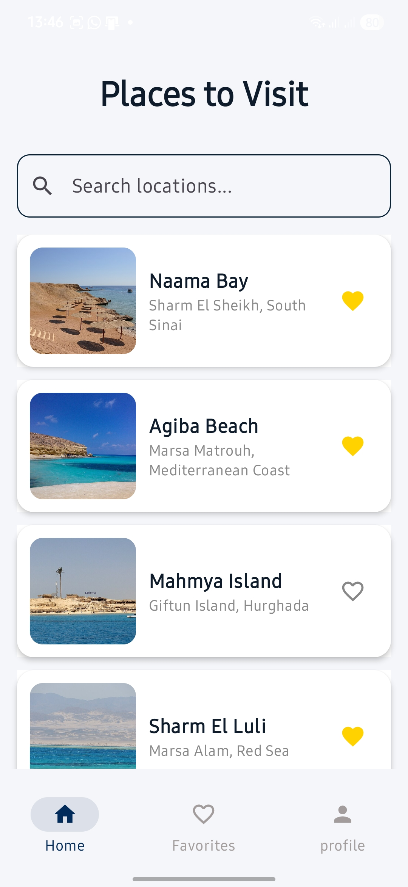
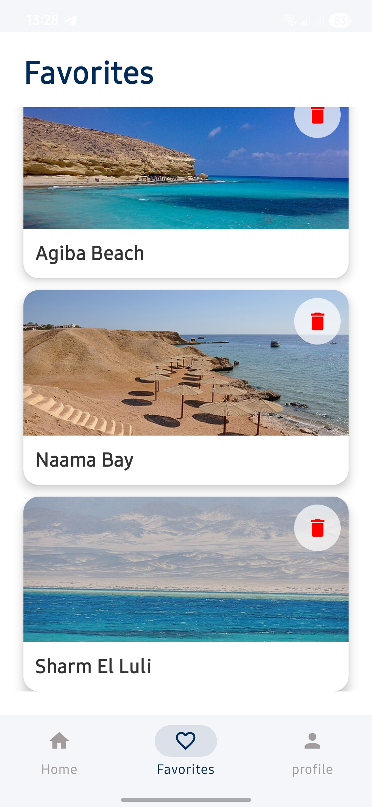
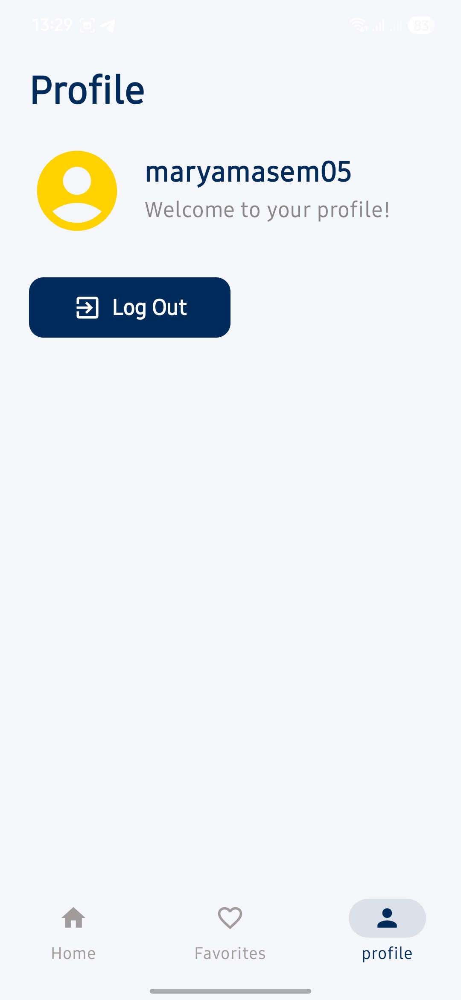

# 🇪🇬 ToEgy – Tourism App for Egypt  
A modern Android application that helps users explore the most important tourist attractions in Egypt.  
The app is built with **Jetpack Compose**, **MVVM architecture**, **Firebase**, and **Retrofit** to provide a fast, clean, and intuitive experience.

---

## ✨ Features

- Browse categorized tourism content (hotels, museums, beaches, temples, airports, etc.)
- Save and manage favorite places
- Open any place location directly in Google Maps
- Secure user authentication (Login, Signup, Forgot Password)
- Smooth UI using Jetpack Compose + Material 3
- Shimmer loading animation
- Clean and scalable MVVM architecture
- Navigation flow using Navigation Compose
- Firebase Realtime Database integration

---

## 🏗️ Tech Stack

| Layer | Technology |
|------|------------|
| Programming Language | Kotlin |
| UI Toolkit | Jetpack Compose (Material 3) |
| Architecture | MVVM |
| Networking | Retrofit + Coroutines |
| State Management | ViewModel + StateFlow |
| Authentication | Firebase Authentication |
| Database | Firebase Realtime Database |
| Navigation | Navigation Compose |
| Animations | Compose Animations + Shimmer Effect |

---

## 📁 Project Structure

```
com.depi.toegy
│
├── api
│   ├── TourismApiService.kt
│   └── TourismViewModel.kt
│
├── model
│   ├── FavoritePlace.kt
│   └── TourismModel.kt
│
├── navigation
│   ├── AuthNavigation.kt
│   └── Navigation.kt
│
├── repo
│   └── FavouritesRepository.kt
│
├── screens
│   ├── DetailScreen.kt
│   ├── EgyptIcon.kt
│   ├── FavoriteScreen.kt
│   ├── ForgotPasswordScreen.kt
│   ├── Home.kt
│   ├── ListScreen.kt
│   ├── LoginScreen.kt
│   ├── MainScreen.kt
│   ├── ProfileScreen.kt
│   ├── ShimmerAnimation.kt
│   ├── SignupScreen.kt
│   └── SplashScreenUI.kt
│
├── ui.theme
│   ├── Color.kt
│   ├── Theme.kt
│   └── Type.kt
│
└── viewModel
    ├── FavoritesViewModel
    ├── ForgotPasswordViewModel
    ├── LoginViewModel
    └── SignupViewModel
```

---

## 📸 Screenshots

Below are some screenshots from the ToEgy App:

<p align="center">
    
  
  
  
  

</p>

<p align="center">
  
  
  
  
  

</p>


## 🧱 Architecture Overview (MVVM)

### **Model**
Defines all data structures:
- `TourismModel` – represents tourism place data  
- `FavoritePlace` – represents user saved places  

### **ViewModel**
Handles:
- Business logic  
- API requests  
- Firebase operations  
- UI state using StateFlow  
Examples:  
`TourismViewModel`, `LoginViewModel`, `SignupViewModel`, `FavoritesViewModel`

### **View (Compose)**
Responsible for:
- Rendering UI  
- Observing ViewModel state  
- Handling user interactions  

Screens include Home, Detail, Profile, Login, Signup, ListScreen, Favorites, etc.

---

## 🗺️ Navigation Flow

### **Authentication Flow**
```
Splash → Login → Signup → ForgotPassword
```

### **Main App Flow**
```
MainScreen
│
├── Home
├── ListScreen/{category}
├── DetailScreen/{place_id}
├── FavoriteScreen
└── ProfileScreen
```

---

## 🗄️ Firebase Database Structure

```
root
│
├── tourism
│   ├── {place_id}
│   │   ├── name: String
│   │   ├── category: String
│   │   ├── description: String
│   │   ├── images: [String]
│   │   └── location:
│   │       ├── latitude: Double
│   │       └── longitude: Double
│
├── favorites
│   ├── {user_id}
│   │   └── {place_id}: true
│
└── users
    ├── {user_id}
        ├── name: String
        ├── email: String
```

---

## 🎨 UI/UX Design

- Material Design 3  
- Shimmer loading animation  
- Custom icons and clean layouts  
- Smooth Compose transitions  
- Modern color palette and typography  
- Responsive design for all screen sizes  

---

## 📌 Summary

ToEgy is a scalable and user-friendly tourism application showcasing Egypt’s attractions through a clean and modern Android architecture.  
Its integration with Firebase, Retrofit, Compose, and Maps support makes it suitable for future expansion—such as booking systems, AR tours, or interactive map navigation.

